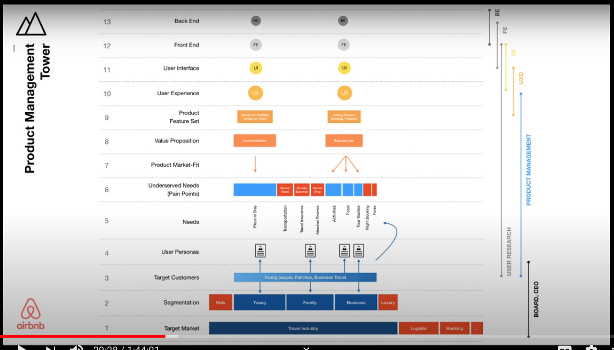
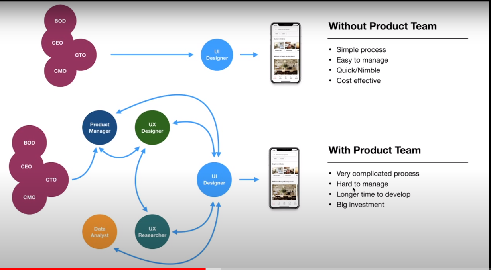

# Product Management for Managers

#video #pm

## Note

- hiểu được cái product mục tiêu hướng đến là gì?, làm sao để thực hiện nó, đối tượng, cái nhu cầu mình giải quyết được ở đây là gì?

- tại sao chúng ta cần một product team, khi without product team thì sẽ tốn ít hơn nhưng vẫn ra được sản phẩm? -> ra sản phẩm có được người dùng xài không mới là vần đề chứ không phải đưa ra nhanh rồi người dùng xài còn chết

## Reference

- Author: [Hieu Nguyen](20210917125233.md)
- Link: [coroference - Product Management for Managers - YouTube](https://www.youtube.com/watch?v=kMLgug3GrkU&list=PL1bLXQ3Ow2lZz-JfwfITbeWhcxFaKYiZ-)
